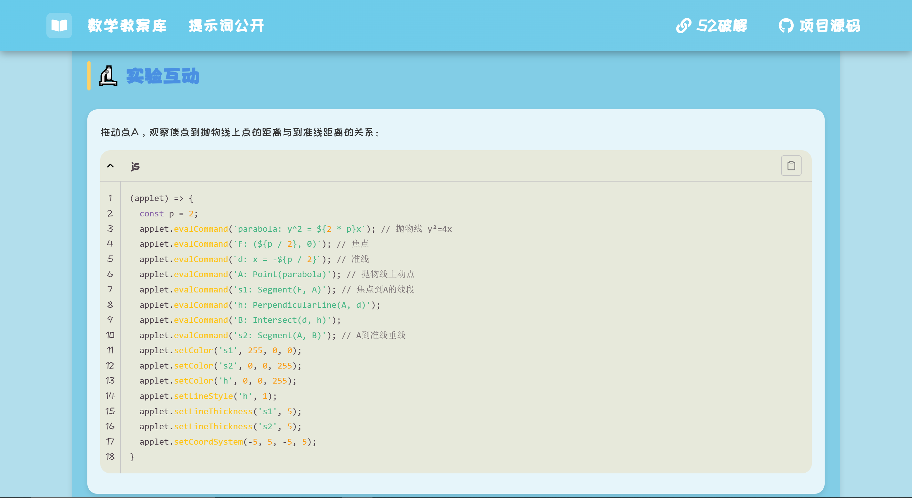
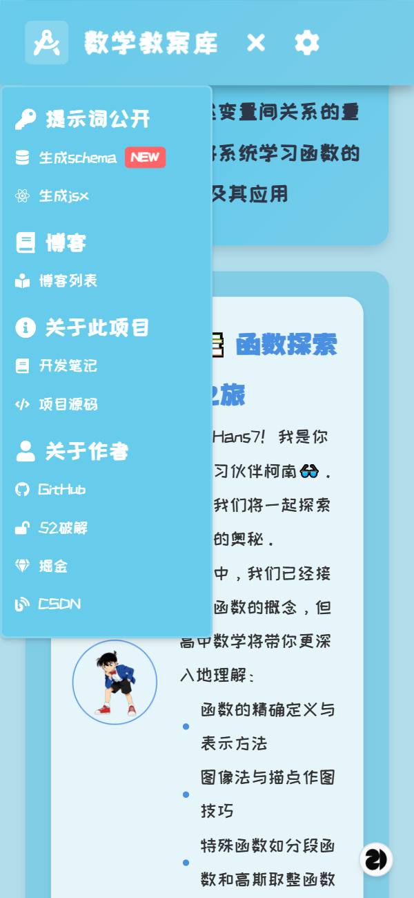

[TOC]

# 通过为前端项目接入GeoGebra，初步研究AI时代数学教案的生成方案（已部署GitHub Pages）

## 引言

我偶然刷到了[这个视频](https://www.bilibili.com/video/BV1UeK8zAErv)，它给我一种强烈的感觉，就是下一代的每一个学生，只要会说HTML、Tailwind CSS、JavaScript这少数几个词，就能轻松生成属于自己的互动性极强的数学课件。我感受到了极其强烈的焦虑，下一代的学生，肯定能比我们这一代人更快地更新迭代自己的知识体系。我们一天才能学会的东西，他们可能一小时就能学会。以后他们的工作能力肯定能轻松碾压我们。所以至少在LLM尚未十分成熟的2025，我想走在下一代人的前面，哪怕只是用行动骗骗自己，有能力比下一代人更快驾驭LLM……

咳咳，先不抒情了。我写这个开源项目的初衷主要有：

1. 研究如何用大语言模型快速生成覆盖从小学到数学专业/研究生难度的，不同类型的数学教案。
2. 研究如何在前端页面嵌入**GeoGebra**，增强数学教案的互动性。

[本项目GitHub传送门](https://github.com/Hans774882968/teaching-plan-analytic-geometry)

注意：为了减少该项目的占用空间，本项目并未包含GeoGebra源码。如果想要在本地跑起来这个项目，请自行下载[GeoGebra Math Apps Bundle](https://download.geogebra.org/package/geogebra-math-apps-bundle)，并复制里面的web3d文件夹和css文件夹到本项目的`public\geogebra`。

### 250726：本项目已部署到 GitHub Pages

[传送门](https://hans774882968.github.io/teaching-plan-analytic-geometry)。欢迎参观~

现阶段的整体效果-PC端：


移动端：


本文 52pojie：https://www.52pojie.cn/thread-2048343-1-1.html

本文 CSDN：https://blog.csdn.net/hans774882968/article/details/149613117

本文 juejin：https://juejin.cn/post/7530464752063348782

**作者：[hans774882968](https://blog.csdn.net/hans774882968)以及[hans774882968](https://juejin.cn/user/1464964842528888)以及[hans774882968](https://www.52pojie.cn/home.php?mod=space&uid=1906177)**

## 【困难】如何给React项目接入GeoGebra

翻了下高中数学必修一（进入 https://jc.pep.com.cn/ ，选择高中数学必修第一册B版），现在已经升级为使用GeoGebra了。我还清楚地记得，15年的数学课本还是用几何画板举例的。


为什么这个项目要接入GeoGebra不用多说了吧~伟大，无需多言！

参考[GeoGebra官方文档](https://geogebra.github.io/docs/reference/en/GeoGebra_Apps_Embedding/)，我们主要需要：

1. 导入：`<script src="GeoGebra/deployggb.js"></script>`。
2. 如果是**自托管**，需要加上这句：`applet.setHTML5Codebase('GeoGebra/HTML5/5.0/web3d/');`。否则忽略。

### 封装 Geogebra.jsx

为了方便在React中使用GeoGebra，我们不妨封装一个`Geogebra.jsx`。我找到了一个叫`react-geogebra`的npm包，但看了眼那个源码。天哪！代码质量不太得，eslint报错有十几个！索性复制下来，自己改改。

[src\component\Geogebra.jsx](https://github.com/Hans774882968/teaching-plan-analytic-geometry/blob/main/src/component/Geogebra.jsx), copy from https://github.com/pfaffmann/react-geogebra/blob/master/src/index.js

```jsx
import { useEffect, useState, useRef, useCallback } from 'react';
import styles from './Geogebra.module.scss';
import { cn } from '@/lib/utils';

const Geogebra = (props) => {
  const defaultProps = {
    appName: 'classic',
    height: 600,
    showToolBar: true,
    showAlgebraInput: true,
    showMenuBar: true,
  };
  const mergedProps = { ...defaultProps, ...props };
  const refProps = useRef(mergedProps);

  const { onReady, appletOnLoad } = refProps.current;
  let { id, LoadComponent, debug } = refProps.current;
  if (!id) {
    id = 'ggb-applet';
  }
  if (!debug) {
    debug = false;
  }
  // if a JSX Component is not given as a prop, use h3 with children
  if (!LoadComponent) {
    LoadComponent = ({ children }) => <h3>{children}</h3>;
  }

  const [watchPropsChange, setWatchPropsChange] = useState(false);
  // gets called by Geogebra after the Applet is ready
  const onAppletReady = useCallback(
    (ggbApi) => {
      if (appletOnLoad) appletOnLoad(ggbApi);
      if (onReady) onReady();
      debug && console.log(`Applet with id "${id}" is ready`);
    },
    [appletOnLoad, debug, id, onReady]
  );

  useEffect(() => {
    if (window.GGBApplet) {
      const parameter = JSON.parse(JSON.stringify(refProps.current));
      parameter.appletOnLoad = onAppletReady;
      const ggbApp = new window.GGBApplet(parameter, true);
      ggbApp.setHTML5Codebase('/geogebra/web3d/');
      ggbApp.inject(id);
      setWatchPropsChange(false);
      debug &&
        console.log(`applet with id "${id}" successfully injected into the DOM`);
    }

    return () => {
      const tag = document.getElementById(`${id}-holder`);
      if (tag) {
        tag.lastChild.textContent = '';
      }
    };
  }, [watchPropsChange, debug, id, onAppletReady]);

  return (
    <div id={`${id}-holder`} className={cn(styles.geogebraWrapper, props.className)}>
      <div id={id} style={{ width: '100%' }}></div>
    </div>
  );
};

export default Geogebra;
```

这里的核心代码是：

```js
const ggbApp = new window.GGBApplet(parameter, true);
ggbApp.setHTML5Codebase('/geogebra/web3d/');
ggbApp.inject(id);
```

调用：

```jsx
<Geogebra
  id="geogebra"
  width={1200}
  height={600}
  showToolbar={true}
  showMenuBar={true}
  allowStyleBar={true}
  showAlgebraInput={true}
  enableLabelDrags={false}
  enableShiftDragZoom={true}
  capturingThreshold={null}
  showToolBarHelp={false}
  errorDialogsActive={true}
  showTutorialLink={true}
/>
```

然后就到踩坑时间！

### GeoGebra 的自托管解决方案

如果把`ggbApp.setHTML5Codebase('/geogebra/web3d/')`去掉，那么geogebra已经能正常工作，但静态资源必须通过网络下载，而且资源总共有几十MB，所以加载时间有点长。于是我们不得不考虑自托管解决方案。

首先，按[官方文档](https://geogebra.github.io/docs/reference/en/GeoGebra_Apps_Embedding/)指示下载[GeoGebra Math Apps Bundle](https://download.geogebra.org/package/geogebra-math-apps-bundle)，接着设置`ggbApp.setHTML5Codebase('/geogebra/web3d/')`，然后把下载的包的web3d文件夹复制到本项目的`public\geogebra\web3d`。

到此为止都自我感觉良好。运行！不出所料，报错了！这是因为它请求了 http://localhost:5215/261BBF4225A3B6C8FD1B8B949B793666.cache.js 而非预期的 http://localhost:5215/geogebra/web3d/261BBF4225A3B6C8FD1B8B949B793666.cache.js 。直接挪动这个`cache.js`似乎可以解决，但不太优雅。

于是我排查源码，发现这个cache文件的路径是由`web3d.__moduleBase`（位于`geogebra\web3d\web3d.nocache.js`）决定的。搜索这个变量名，发现`web3d.__moduleBase = B()`这句赋值决定了其值，外部没法直接修改它。所以我们继续看B函数，发现最终是这句代码决定其路径：

```js
// geogebra\web3d\web3d.nocache.js
// 我把原有代码的 O, P, W 等还原为常量
function e(a) {
  var b = a.lastIndexOf('#');
  if (b == -1) {
    b = a.length;
  }
  var c = a.indexOf('?');
  if (c == -1) {
    c = a.length;
  }
  var d = a.lastIndexOf('/', Math.min(c, b));
  return d >= 0 ? a.substring(0, d + 1) : '';
}

if(k == W && j()) {k = e(o.location.href);}
k = f(k);
return k;
```

我们把它改成`k = e(o.location.href + 'geogebra/web3d/');`，问题解决！

#### 250629更新

接入react-router后，需要改为`k = e('/geogebra/web3d/');`。

#### 250726更新

为了能够部署到GitHub Pages，我们进一步更新为：`k = e(window.GGB_WEB3D_NO_CACHE_BASE_PATH);`。这个全局变量我们约定在`main.jsx`设置：

```js
window.GGB_WEB3D_NO_CACHE_BASE_PATH = getGeogebraHTML5Codebase();

// src\lib\getWebsiteBasePath.js
export function getGeogebraHTML5Codebase() {
  const isGitHubPages = import.meta.env.VITE_DEPLOY_TARGET === 'github-pages';
  const codebase = isGitHubPages ? `${GITHUB_PAGE_BASE}geogebra/web3d/` : '/geogebra/web3d/';
  return codebase;
}
```

详见后文《部署到GitHub Pages》一节。

之后发现，控制台没有报错了，但样式不对劲。这是因为它请求了`geogebra/css/...`。所以我们不能只复制web3d文件夹，还要把同级的css文件夹复制过去。至此搞定！

### GeoGebra 的神秘 bug

打开控制台，窗口自动缩小，此时点击设置，选择坐标轴的颜色，会发现点击对应格子，选中的颜色却不是鼠标对应的格子的颜色。把控制台关了，窗口无法回到原来的大小，于是问题还在。控制台从未开启则没有这个问题。

### GeoGebra 接入总结

1. 按官方文档说的做。
2. 复制web3d和css两个文件夹到`public\geogebra`。
3. `geogebra\web3d\web3d.nocache.js`的`k = e(o.location.href)`改成`k = e('/geogebra/web3d/');`。

## 用GeoGebra进行数学教学

可参考[docs\Geogebra组件文档.md](https://github.com/Hans774882968/teaching-plan-analytic-geometry/blob/main/docs/Geogebra%E7%BB%84%E4%BB%B6%E6%96%87%E6%A1%A3.md)。下面仅给出验证椭圆第一定义的示例脚本：

```jsx
const drawEllipse = (applet) => {
  applet.evalCommand('ellipse: x^2/25 + y^2/9 = 1'); // 绘制椭圆
  applet.setColor('ellipse', 255, 0, 0);
  applet.setLineThickness('ellipse', 3);
  applet.setCaption('ellipse', '椭圆: \\frac{x^2}{25} + \\frac{y^2}{9} = 1');

  applet.evalCommand('A: Point(ellipse)'); // 绘制椭圆上的动点 A
  applet.evalCommand('C1: (4, 0)'); // 绘制椭圆的右焦点 C1
  applet.evalCommand('C2: (-4, 0)'); // 绘制椭圆的左焦点 C2
  applet.evalCommand('s1: Segment(C1, A)'); // 线段 C1A
  applet.evalCommand('s2: Segment(C2, A)'); // 线段 C2A
  applet.evalCommand('lenSum: s1 + s2'); // 验证椭圆上任意一点 A 到两个焦点的距离和为定值

  applet.setCoordSystem(-6, 6, -4, 4);
};

<Geogebra
  id="geogebra"
  width={1200}
  height={600}
  appletOnLoad={drawEllipse}
/>
```

### 如何快速学习GeoGebra的语法？以“双曲线的反函数”为例

除了看官方文档以外，还有一些更简单的方式：

1. 操作一下软件的上方工具栏，比如“Reflect about Point”（设置关于点A关于点B对称的点），然后点击平面直角坐标系中已有的两个对象，比如在这个例子中，就是两个点，就能看到等式列表新增了一条等式。
2. 可以猜测“Reflect about Point”的命令含有Reflect字样，在等式输入框输入“Reflect”，便能根据软件的提示方便地补全命令。

另外，我还尝试问DeepSeek：

> 大佬，我有如下Geogebra代码：/* 省略 */。请问如何写代码验证A0点确实在hyperbola2上

它确实回答出来了，但给的回答太复杂了。其实，“验证双曲线的反函数还是双曲线”可以通过Reflect和Distance命令简单实现。如下（来自[src\hyperbolaDefinition\config.jsx](https://github.com/Hans774882968/teaching-plan-analytic-geometry/blob/main/src/hyperbolaDefinition/config.jsx)）：

```js
(applet) => {
  applet.evalCommand('hyperbola1: x^2/16 - y^2/9 = 1');
  applet.setColor('hyperbola1', 255, 0, 0);
  applet.setLineThickness('hyperbola1', 3);
  applet.evalCommand('hyperbola2: y^2/16 - x^2/9 = 1');
  applet.setColor('hyperbola2', 0, 0, 255);
  applet.setLineThickness('hyperbola2', 3);

  applet.evalCommand('A: Point(hyperbola1)');
  applet.evalCommand('l: y = x');
  applet.evalCommand('A\': Reflect(A, l)');
  applet.setLineThickness('l', 1);
  applet.evalCommand('Distance(A\', hyperbola2)');

  applet.setCoordSystem(-10, 10, -8, 8);
}
```

## 在React项目中用`framer-motion`实现动画

`framer-motion`其实很强大，但是我在此只是把它当作CSS动画的语法糖。看一个例子就秒懂了（[`src\TeachingPlanList.jsx`](https://github.com/Hans774882968/teaching-plan-analytic-geometry/blob/main/src/TeachingPlanList.jsx)）：

```jsx
<motion.div
  initial={{ opacity: 0, y: 20 }}
  animate={{ opacity: 1, y: 0 }}
  transition={{ duration: 0.5, delay: index * 0.1 }}
  whileHover={{ scale: 1.03 }}
  className={cn(
    styles.lessonCard,
    styles.bounceInAnimation,
    'bg-white rounded-xl overflow-hidden shadow-lg'
  )}
/>
```

`y`控制盒子往上飞，鼠标放上去盒子会变大。

## 【常规】React项目如何支持Katex公式

### 在 ReactNode 中：@matejmazur/react-katex

相关文件：

- `src\ellipseDefinition\EllipseDefinition.jsx`
- `src\ellipseDefinition\config.jsx`

首先

```powershell
bun add katex @matejmazur/react-katex
```

接着在`src\App.jsx`：

```jsx
import 'katex/dist/katex.min.css';
```

然后直接引用：

```jsx
import TeX from '@matejmazur/react-katex';

<TeX>{'c = \\sqrt{a^2 - b^2}'}</TeX>
<TeX block>{String.raw`\frac{x^2}{a^2} + \frac{y^2}{b^2} = 1`}</TeX>
```

因为我希望DeepSeek生成一个`config.js`的Schema方便后续配置，所以我实际上是在`src\ellipseDefinition\config.jsx`导入的`TeX`。大致方案如下：

config配置示例：

```jsx
export const config = {
  properties: {
    title: '椭圆的重要性质',
    items: [
      <><strong className="highlight">离心率</strong>：<TeX>{'e = \\frac{c}{a} \\ (0 < e < 1)'}</TeX>，表示椭圆的扁平程度</>,
      <><strong className="highlight">焦点性质</strong>：从椭圆一个焦点发出的光线，经椭圆反射后会经过另一个焦点</>,
      <><strong className="highlight">对称性</strong>：椭圆关于长轴、短轴和中心对称</>,
      <><strong className="hard">面积公式</strong>：<TeX>{'S = \\pi \\times a \\times b'}</TeX></>,
    ],
  },
}
```

`EllipseDefinition.jsx`调用：

```jsx
<div className="knowledge-point">
  <h3>🔍 {config.properties.title}</h3>
  {config.properties.items.map((item, i) => (
    <p key={i}>{i + 1}. {item}</p>
  ))}
</div>
```

### 在 Markdown String 中：marked + marked-katex-extension

为了方便LLM生成课件，我们需要让项目支持渲染Markdown。之后我们只需要在配置文件中写Markdown字符串即可。为了在marked中支持Katex公式，我们可以自己写一个renderer（我确实有搜到采用这种方案的），也可以用现成的包：`marked-katex-extension`。

首先

```powershell
bun add marked highlight.js marked-katex-extension
```

接着我们可以直接实现一个React组件[`src\component\MarkdownRenderer.jsx`](https://github.com/Hans774882968/teaching-plan-analytic-geometry/blob/main/src/component/MarkdownRenderer.jsx)，调用marked，渲染Markdown String：

```jsx
import { processMarkdown } from '@/lib/marked';
import { useEffect, useState } from 'react';
import { cn } from '@/lib/utils';
import 'highlight.js/styles/paraiso-light.css';
import useCodeBlockSetup from '../hooks/useCodeBlockSetup';
import './MarkdownRenderer.scss';

export default function MarkdownRenderer({ className, content, ...rest }) {
  const [htmlContent, setHtmlContent] = useState('');
  const [isLoading, setIsLoading] = useState(false);

  const tpmMdContainerRef = useCodeBlockSetup();

  useEffect(() => {
    setIsLoading(true);
    const parseResult = processMarkdown(content);
    parseResult
      .then(result => {
        setHtmlContent(result);
        setIsLoading(false);
      })
      .catch(error => {
        console.error('Error processing markdown:', error);
        setHtmlContent(content);
        setIsLoading(false);
      });
  }, [content]);

  if (isLoading) {
    return <div className={className} {...rest}>加载中...</div>;
  }
  if (typeof content === 'string') {
    return (
      <div
        ref={tpmMdContainerRef}
        dangerouslySetInnerHTML={{ __html: htmlContent }}
        className={cn('tpm-markdown-container max-w-none', className)}
        {...rest}
      />
    );
  }
  return content;
}
```

我们完全可以把marked初始化`marked-katex-extension`等插件的代码写在jsx文件里，但为了让代码更清晰，我们不妨抽出一个文件`src\lib\marked.js`，专门处理marked的初始化：

```js
import { marked } from 'marked';
import markedKatex from 'marked-katex-extension';
import { markedHighlight } from 'marked-highlight';
import hljs from 'highlight.js';

// 为了简单，先使用 marked-highlight ，后面会改成古法手作 renderer
marked.use(
  markedHighlight({
    emptyLangClass: 'hljs',
    langPrefix: 'hljs language-',
    highlight(code, lang) {
      const language = hljs.getLanguage(lang) ? lang : 'plaintext';
      return hljs.highlight(code, { language }).value;
    },
  })
);

marked.use(markedKatex({
  throwOnError: false,
}));

/**
 * 注意：
 * 1. markdown 文本尽量不要以多余的空格开头，否则 marked 会将其解析为代码块，导致结果不合预期
 * 2. katex 格式的公式和前面的文本留一个空格，否则会报错
 * @param {string} _content markdown content
 * @returns {string} html or content
 */
export const processMarkdown = async (_content) => {
  if (typeof _content !== 'string') {
    return _content;
  }
  // _content 以 white spaces 开头时，marked 会将其解析为代码块，因此要 trim
  const content = _content.trim();
  // Handle both Promise and string return types from marked()
  const result = marked(content);
  const html = typeof result === 'string' ? result : await result;
  return html;
  // TODO: 接入 sanitize html 会导致 style 属性被吞，设置 allowedAttributes 未生效
};

```

这里有一个悬而未决的问题：接入`sanitize-html`会导致 style 属性被吞，导致Katex出现样式错误。官方文档说设置`allowedAttributes`就行，但我设置以后没生效。我懒得研究这个了，先放着吧。

## 【常规】数学教案生成方案探究：从抽象出搭积木的组件，到彻底Schema化

我最初的想法是，先用DeepSeek直接生成第一个教案《椭圆的定义与性质》的HTML代码，接着将其改造为React代码，然后编写规范，让LLM根据规范生成其他数学教案的React组件和`config.jsx`。但我发现了不少痛点：

1. LLM生成的教案和已有的教案代码采用完全不一样的代码规范、不一样的技术选型、不一样的CSS代码。要在一个单页应用中统一它们存在困难。
2. 看似让LLM生成完整HTML代码的方案可以激发其创造力，但实测发现，LLM真的很懒，写东西语焉不详，也不怎么生成第一个教案完全没有的新东西、新模式。

但我的幻想还没完全磨灭。我想着，抽象出一些组件，让LLM像搭积木一样搭出页面，也许能激发其创造力。于是有了[docs\新课件提示词\生成jsx.md](https://github.com/Hans774882968/teaching-plan-analytic-geometry/blob/main/docs/%E6%96%B0%E8%AF%BE%E4%BB%B6%E6%8F%90%E7%A4%BA%E8%AF%8D/%E7%94%9F%E6%88%90jsx.md)这个提示词文件，以及下面这些组件：

```jsx
import Section from '@/component/teachingPlan/Section';
import KnowledgePoint from '@/component/teachingPlan/KnowledgePoint';
import Card from '@/component/teachingPlan/Card';
import Header from '@/component/teachingPlan/Header';
import LearningPartnerCard from '@/component/teachingPlan/LearningPartnerCard';
import Think from '@/component/teachingPlan/Think';
import Footer from '@/component/teachingPlan/Footer';
```

- @/src\component\teachingPlan\Section.jsx ：包裹每个模块
- @/src/component/teachingPlan/KnowledgePoint.jsx ：包裹一个知识点
- @/src\component\teachingPlan\Card.jsx ：可用于包裹各种内容
- @/src\component\teachingPlan\Header.jsx ：标题栏
- @/src\component\teachingPlan\LearningPartnerCard.jsx ：学习伙伴
- @/src/component/teachingPlan/Think.jsx ：包裹一道思考题。该组件可出现在 KnowledgePoint 或 Card 中。如果在 Card 中，则它是 KnowledgePoint 的 sibling
- @/src\component\teachingPlan\Footer.jsx ：页脚

但我发现，只要保留自由度，仍然允许LLM生成整个页面React组件，上面的痛点1和2就无法解决。我仍然需要手动更改大量代码。既然LLM在教案生成方面就是没啥创造力，我就想，干脆彻底Schema化，页面一律用标准页面生成算了。这样，LLM也能专注于内容，就像在生成用于Marp产出PPT文件的Markdown文档一样。

于是有了：

1. [docs\新课件提示词\生成schema.md](https://github.com/Hans774882968/teaching-plan-analytic-geometry/blob/main/docs/%E6%96%B0%E8%AF%BE%E4%BB%B6%E6%8F%90%E7%A4%BA%E8%AF%8D/%E7%94%9F%E6%88%90schema.md)
2. 页面结构的类型描述：[src\component\teachingPlan\StandardPageStructure.d.ts](https://github.com/Hans774882968/teaching-plan-analytic-geometry/blob/main/src/component/teachingPlan/StandardPageStructure.d.ts)
3. 标准页面：[src\component\teachingPlan\StandardPage.jsx](https://github.com/Hans774882968/teaching-plan-analytic-geometry/blob/main/src/component/teachingPlan/StandardPage.jsx)

我决定先用提示词《生成schema.md》生成《平面向量的定义及其线性运算》课件的`src\planeVectorDefinition\config.jsx`，再看DeepSeek的反馈慢慢调整提示词。实验表明，这条路走得通，只需要依据DeepSeek欠考虑的点微调上述几个文档即可。TODO: 开发一个网页，方便地完成提示词的拼接。左边是编辑器，右边是预览区。仍然是用vite的虚拟模块实现。

### 【常规】Vite的虚拟模块：在页面中展示提示词的Markdown文档

我希望在我的网站展示项目用到的提示词。这是一类静态站点生成的需求，vitepress之类的框架都有这个能力，但我们在此想要一个足够轻量的方案。我通过搜索引擎已经了解到，Vite的**虚拟模块**借用了Vite的开发服务器的能力，可以达到类似于后端接口的效果。

于是我问DeepSeek：“大佬，你是一名专家前端工程师，精通前端工程化。请叫我hans7。我有一个React+vite+react-router-dom+marked的项目，希望实现以下功能：在打包时能够读取一个本地文件系统的markdown文件的内容，如README.md，通过marked渲染，然后生成一个新的组件，这个组件的路由是/prompt-display。请问如何用自定义vite插件实现？”DeepSeek给了我完整代码，可惜它的代码不能跑，因为Vite的虚拟模块不支持JSX。所以我改了下代码，让虚拟模块仅返回markdown字符串。[`src\plugins\vite-plugin-prompt-display.js`](https://github.com/Hans774882968/teaching-plan-analytic-geometry/blob/main/src/plugins/vite-plugin-prompt-display.js)：

```js
import fs from 'fs';
import path from 'path';

const genSchemaPromptPath = path.resolve(process.cwd(), 'docs', '新课件提示词', '生成schema.md');
const genSchemaRelativePath = path.relative(process.cwd(), genSchemaPromptPath);
const genJsxPromptPath = path.resolve(process.cwd(), 'docs', '新课件提示词', '生成jsx.md');
const genJsxRelativePath = path.relative(process.cwd(), genJsxPromptPath);
const promptFilePaths = [genSchemaPromptPath, genJsxPromptPath];

function getEncodedPromptContent(filePath) {
  const content = fs.readFileSync(filePath, 'utf-8');
  return encodeURI(content);
}

export default function promptDisplayPlugin() {
  const virtualModuleId = 'virtual:prompt-display';
  const resolvedVirtualModuleId = '\0' + virtualModuleId;

  return {
    name: 'vite-plugin-prompt-display',
    configureServer(server) {
      // 监听提示词文件变化
      promptFilePaths.forEach((promptFilePath) => {
        server.watcher.add(promptFilePath);
      });

      // 文件变化时触发 HMR
      server.watcher.on('change', (file) => {
        if (!promptFilePaths.includes(file)) {
          return;
        }
        // 1. 使虚拟模块缓存失效
        const module = server.moduleGraph.getModuleById(resolvedVirtualModuleId);
        if (module) {
          server.moduleGraph.invalidateModule(module);
        }

        // 2. 通知客户端重新加载模块
        server.ws.send({
          type: 'full-reload',
          path: '*',
        });

        console.log('[tpm] 📄 提示词文件更新', file);
      });
    },
    resolveId(id) {
      if (id === virtualModuleId) return resolvedVirtualModuleId;
    },
    load(id) {
      if (id === resolvedVirtualModuleId) {
        const genSchemaPromptContent = getEncodedPromptContent(genSchemaPromptPath);
        const genJsxPromptContent = getEncodedPromptContent(genJsxPromptPath);

        return `
          export const genSchemaRelativePath = String.raw\`${genSchemaRelativePath}\`;
          export const genJsxRelativePath = String.raw\`${genJsxRelativePath}\`;

          export const genSchemaPrompt = decodeURI(\`${genSchemaPromptContent}\`);
          export const genJsxPrompt = decodeURI(\`${genJsxPromptContent}\`);
        `.trim();
      }
    },
  };
}
```

一些说明：

1. 这个虚拟模块的格式挺标准的，适合教学。
2. 之所以使用`decodeURI`是因为原始字符串有单引号、双引号之类的字符，无法直接拼接为JS代码，我们需要找一种最简单的方式转义这些字符。
3. 这版代码和最新版代码功能一致，区别是最新版封装了两个函数。

在React组件中，直接像import其他文件一样import即可：

```js
import {
  genSchemaPrompt,
  genSchemaRelativePath,
} from 'virtual:prompt-display';
```

查看打包产物可知，Markdown字符串会在构建阶段被完整地打包进JS文件。

### 在网站中展示README

类似地，我还在网站中展示了`README.md`，传送门：[`src\plugins\vite-plugin-readme-display.js`](https://github.com/Hans774882968/teaching-plan-analytic-geometry/blob/main/src/plugins/vite-plugin-readme-display.js)。我项目的README有图片，所以还需要手动把图片复制到`dist`文件夹。配置`rollup-plugin-copy`：

```js
 import copy from 'rollup-plugin-copy';

    copy({
      targets: [
        { src: 'README_assets', dest: 'dist' },
      ],
      hook: 'writeBundle',
    }),
```


### 提示词缺陷修复技巧举例

写一个**多次使用的模板提示词**（在本节中特指[`docs\新课件提示词\生成schema.md`](https://github.com/Hans774882968/teaching-plan-analytic-geometry/blob/main/docs/%E6%96%B0%E8%AF%BE%E4%BB%B6%E6%8F%90%E7%A4%BA%E8%AF%8D/%E7%94%9F%E6%88%90schema.md)）就像写代码一样，不太可能一次性就考虑到所有的细节。所以我们需要根据LLM的反馈，尤其是在“深度思考”过程中的反馈，优化自己的模板提示词。比如：

一、我在生成《函数及其表示方法》课件时，看到DeepSeek在深度思考中输出：“我们在配置文件中只需要按照规范写类名，比如`<h4 className={styles.teachingPlanH4}>`，但是这里我们无法获取styles，所以实际上主组件会处理样式类。但是，为了类型正确，我们按照规范写类名字符串？不，这样不行。因为styles是一个模块，我们必须在配置文件中使用与主组件相同的样式模块。但配置文件是独立的，所以主组件在渲染时会传入styles。（省略更多废话）”就立刻意识到我忘记import styles了，而DeepSeek能力太差，推不出实际情况，需要补充：

```jsx
import styles from '@/component/teachingPlan/basic.module.scss'; // 补上
<h4 className={styles.teachingPlanH4}></h4>
<h5 className={styles.teachingPlanH5}></h5>
<h6 className={styles.teachingPlanH6}></h6>
```

二、发现DeepSeek没有输出`appletOnLoad`函数。一开始有点恼火，但后来注意到，DeepSeek在深度思考中输出：“具体的绘制命令在appletOnLoad中，但这里我们只写命令字符串，因为配置对象中的函数无法序列化，所以实际上在GeogebraItem中，config是一个普通的对象，而绘制命令我们将在描述中说明，或者在conclusion中分析。”

后来我们在`docs\Geogebra组件文档.md`中补充了“如何在JS Config中使用”一节，它也就知道如何实现`appletOnLoad`方法了。

## 【常规】支持路由

我有不止一个课件，所以这个项目自然要支持路由。支持路由挺常规的，跟往常一样`bun add react-router-dom`即可。主要需要注意改一下这句`k = e('/geogebra/web3d/');`（详见《geogebra的自托管解决方案》一节）。`src\App.jsx`：

```jsx
import { BrowserRouter as Router, Routes, Route } from 'react-router-dom';
import { HelmetProvider } from 'react-helmet-async';

const routes = [
  { path: '/', element: <TeachingPlanList /> },
  { path: '/plane-vector-definition', element: <PlaneVectorDefinition /> },
  // ...
  { path: '/404', element: <NotFound /> },
  { path: '*', element: <NotFound /> },
];

function App() {
  return (
    <HelmetProvider>
      <Router>
        <Layout>
          <Routes>
            {
              routes.map((route, index) => (
                <Route
                  key={route.path || `route-${index}`}
                  path={route.path}
                  element={route.element}
                />
              ))
            }
          </Routes>
        </Layout>
      </Router>
    </HelmetProvider>
  );
}
```


## 【常规】AI生成教案网页场景下如何解决样式冲突

我们先生成第一个教案网页，然后研究如何生成其他教案网页。这就有一个绕不过去的问题：如何解决样式冲突？我想到两条路：

1. 尽量少更改AI生成的第一个教案网页，将其放入shadow dom。我尝试了一下，发现主要的困难在于geogebra。这条路也许能走通，但风险太高，**舍弃**。
    1. 它的源码引用了`document.getElementById、document.querySelector`等方法。这些方法都会失效。这个是可解的，hook它们就行。
    2. geogebra引入了5个CSS文件（可以用`document.querySelectorAll('link.ggw_resource')`拿到）。它们无法作用到shadow dom内部。这个也好处理，写段JS手动把它们插入到shadow dom里即可。
    3. 处理上面两点了，就不再有大错误了，但还有一些隐蔽的报错。比如：`:root`指定的CSS变量无法引用到，导致设置坐标轴颜色的OK按钮失去背景色。修改`geogebra/css/bundles/bundle.css`的`:root`为`:root, :host`可解决。
    4. 等式栏的每个条目左上角的三个点点击两次才能出现菜单栏。这个确实不懂怎么解了。
2. 引入scss和css modules。手动或者让AI改好第一个教案网页。然后用第一个教案网页的代码生成开发规范，在后续生成其他教案网页时将开发规范一起输入到提示词里。最后我**选择**了这条路。

附：如何hook `document.getElementById`：

```js
export function getShadowRootWrap() {
  return document.querySelector('.shadow-root-div')?.shadowRoot;
}

const settings = {
  showLog: false,
};

export function hookGetEleById() {
  settings.showLog && console.log('%c[teaching-plan-analytic-geometry] 正在 hook document.getElementById', 'background: #3a2e00; color: #e2c041; padding: 3px 6px;');
  const originalGetEleById = document.getElementById;
  document.getElementById = function (id) {
    settings.showLog && console.log('[teaching-plan-analytic-geometry] document.getElementById matched param', id);
    const shadowRootWrap = getShadowRootWrap();
    if (!shadowRootWrap) {
      return originalGetEleById.call(document, id);
    }
    const res = shadowRootWrap?.querySelector(`#${id}`);
    return res || null;
  };
}
```

## 【常规】接入`shadcn-ui`组件库

我发现这个项目还是需要一些表单组件的，所以我决定接入`shadcn-ui`组件库。我们已经配过Tailwind CSS了，根据官方文档，接下来大致要做：

- 引入shadcn用到的几十个CSS变量
- 引入`jsconfig.json`
- 新建`components.json`

引入CSS变量：我们不妨去 https://tweakcn.com/editor/theme 直接拿好看的主题，我选择的是`modern-minimal`，目前和我项目的蓝色主题比较配。

`components.json`不需要特别配置，直接从官方文档复制粘贴，改下`css`和`components`属性就行。

`jsconfig.json`可以理解为`tsconfig.json`在无TS的开发环境的简化版，可以方便IDE实现智能补全等特性，但shadcn的CLI也会用到，所以我们不得不配置一下。

```json
{
  "compilerOptions": {
    "baseUrl": ".",
    "paths": {
      "@/*": [
        "src/*"
      ]
    }
  },
  "exclude": [
    "node_modules",
    "dist"
  ],
  "include": [
    "src/**/*",
    "tests/**/*"
  ]
}
```

接下来可以直接尝试下载 21st.dev 这个网站提供的一些好看的组件：`bunx --bun shadcn@latest add "https://21st.dev/r/originui/numbered-pagination"`。

## 【常规】`Think`组件

效果：


这个组件唯一值得说的就是如何实现展开/收起的过渡动画。我们用一个变量记录是否展开：`const [isOpen, setIsOpen] = useState(false);`，然后用CSS transition或者`framer-motion`控制`max-height`的增减。

```jsx
<motion.div
  className={styles.answerRow}
  initial={{ maxHeight: 0, marginTop: '0' }}
  animate={{
    maxHeight: isOpen ? answerRowMaxHeight || '100px' : 0,
    marginTop: isOpen ? '8px' : '0',
  }}
  transition={{ duration: 0.3 }}
>
  <MarkdownRenderer content={answer} />
</motion.div>
```

我们必须要指定一个具体的`max-height`，否则不会有动画。因此我选择让外界传入这个属性，然后手工调整。

另外，上面设置的`marginTop`是为了照顾问题和答案之间的分割线。

## 【困难】Markdown 代码块交互升级：展示行号、支持展开代码块、复制代码、下载代码

呜呜呜，我确实后悔没有做足够多技术调研，一直没发现有`react-markdown`这个包，所以现在也只能将就用marked渲染Markdown。

效果：



如果只使用`marked-highlight`插件，拿到的代码块就只展示了代码块。但我们看DeepSeek官网等人们熟悉的页面，里面的代码块都有行号，支持复制，支持展开代码等功能。我问LLM以及在互联网上搜，都没有搜到现成的解决方案，所以我认定这是要古法手作编程的。网上冲浪一小会以后，我觉得掘金的“展开代码块”的设计和`vitepress`的复制按钮的点击效果不错，因此决定把它们抄过来。

### 【困难】不得不在React中写原生HTML代码

我翻了`marked-highlight`的源码，发现它提供的自定义能力太弱了，所以我决定抛弃`marked-highlight`，自定义renderer实现（这其实也是marked-highlight的实现方式）。我们不妨把相关逻辑单独提取出一个文件，于是有了[`src\lib\hljsRenderer.js`](https://github.com/Hans774882968/teaching-plan-analytic-geometry/blob/main/src/lib/hljsRenderer.js)：

```js
import hljs from 'highlight.js';

function getLineNumbersHtml(lineLength) {
  const lineNumbersCode = [...Array(lineLength)]
    .map(
      (_, index) =>
        `<span class="line-number">${index + 1}</span><br>`
    )
    .join('');

  const lineNumbersWrapperCode = `<div class="line-numbers-wrapper" aria-hidden="true">${lineNumbersCode}</div>`;
  return lineNumbersWrapperCode;
}

export default {
  code({ lang, text: code }) {
    const language = hljs.getLanguage(lang) ? lang : 'plaintext';
    const highlighted = hljs.highlight(code, { language }).value;

    const dataCode = encodeURI(code);

    const lineLength = code.split('\n').length;
    const lineNumbersHtml = getLineNumbersHtml(lineLength);

    return `
<div class="code-block-wrapper" data-language="${language}" data-line-count="${lineLength}">
  <div class="code-header">
    <div class="header-left-part">
      <div class="svg-chevron-down-wrapper" title="展开代码块"></div>
      <span class="language-tag">${language}</span>
    </div>
    <div class="header-right-part">
      <button title="复制代码" class="copy-button" data-code="${dataCode}"></button>
      <div class="svg-download-wrapper" title="下载代码"></div>
    </div>
  </div>
  <div class="code-body">
    ${lineNumbersHtml}
    <pre class="code-pre"><code class="highlighted-code hljs language-${language}">${highlighted}</code></pre>
  </div>
</div>`.trim();
  },
};
```

在renderer里拼接一大段HTML确实挺难绷的，而且有XSS风险，但我确实没找到能在React中优雅地完成这件事的方案。可以看到我在上面设置了一个留空的`svg-chevron-down-wrapper`，这是为了方便JS插入“展开代码块”的svg图标。

1. 为了给这些HTML代码加上CSS，我写了[`src\styles\code-block.scss`](https://github.com/Hans774882968/teaching-plan-analytic-geometry/blob/main/src/styles/code-block.scss)，供入口`main.jsx`调用。
2. 为了实现复制代码等功能，我们需要写大段大段的原生JS。为此，我们写一个自定义hook（[`src\hooks\useCodeBlockSetup.js`](https://github.com/Hans774882968/teaching-plan-analytic-geometry/blob/main/src/hooks/useCodeBlockSetup.js)），供`MarkdownRenderer`组件调用。

### `src\hooks\useCodeBlockSetup.js`的大致框架

```js
import { useEffect, useRef } from 'react';
import ChevronDown from '@/assets/fa-chevron-down.svg';
import { CODE_BODY_INITIAL_MAX_HEIGHT } from '@/common/consts';

export default function useCodeBlockSetup() {
  const tpmMdContainerRef = useRef(null);

  useEffect(() => {
    const codeBlockWrapperSetup = () => {
      tpmMdContainerRef.current?.querySelectorAll('.code-block-wrapper')?.forEach((codeBlockWrapper) => {
        // 设置 code-block-wrapper 的样式
      });

      tpmMdContainerRef.current?.querySelectorAll('.code-block-wrapper .svg-chevron-down-wrapper')?.forEach((svgChevronDownWrapper) => {
        if (svgChevronDownWrapper.children.length) {
          return;
        }
        // 插入展开代码块的 svg 图标、注册点击事件
      });

      tpmMdContainerRef.current?.querySelectorAll('.code-block-wrapper .copy-button')?.forEach((button) => {
        // 注册点击事件
      });
    };

    codeBlockWrapperSetup();

    const setupObserver = new MutationObserver(codeBlockWrapperSetup);
    tpmMdContainerRef.current && setupObserver.observe(tpmMdContainerRef.current, {
      subtree: true,
      childList: true,
    });

    return () => {
      setupObserver.disconnect();
    };
  }, []);

  return tpmMdContainerRef;
}
```

在`useEffect`里用`MutationObserver`是基础操作了，而对`tpmMdContainerRef.current`的操作就是在管理一个`Markdown`块下所有的`code-block-wrapper`。

`MarkdownRenderer`调用：

```jsx
const tpmMdContainerRef = useCodeBlockSetup();
<div ref={tpmMdContainerRef} />
```


### 【常规】让`code-block-wrapper`的样式与代码块保持一致

250811更新：该方案已被废弃，请参考《编写 postcss 插件：如何在 marked + highlight.js 中实现切换代码块风格》。

我之前引用了`paraiso-light`主题，这个主题会设置代码块的背景色和默认文字颜色，所以我的`code-block-wrapper`需要拿到这个主题设置以后的CSS。这个活我认为只能用JS实现。

```js
const codeNode = codeBlockWrapper.querySelector('.highlighted-code');
const codeNodeComputedStyle = getComputedStyle(codeNode, null);
const codeNodeBgColor = codeNodeComputedStyle.getPropertyValue('background-color');
const codeNodeColor = codeNodeComputedStyle.getPropertyValue('color');
codeBlockWrapper.style.backgroundColor = codeNodeBgColor;
codeBlockWrapper.style.color = codeNodeColor;
```


### 【常规】展开、收起代码块支持过渡动画

这个可以直接挪用我之前的[Think组件](https://github.com/Hans774882968/teaching-plan-analytic-geometry/blob/main/src/component/teachingPlan/Think.jsx)的实现方案。我们让DeepSeek把motion转为原生CSS：

```markdown
大佬，你是一名专家前端工程师，精通前端工程化。请叫我hans7。我有一个react + framer-motion项目，有如下代码：
请忽略其他代码，将motion.span和motion.div的initial、animate、transition属性翻译为css代码，类名分别叫.span和.div。
```

[`src\styles\code-block.scss`](https://github.com/Hans774882968/teaching-plan-analytic-geometry/blob/main/src/styles/code-block.scss)相关代码大致如下：

```scss
.code-body {
  // ...
  transition: max-height 0.3s ease;
  max-height: var(--code-body-initial-max-height);

  .line-numbers-wrapper {
    // ...
  }

  .code-pre {
    flex: 1;
    overflow-x: auto;

    .highlighted-code {
      max-height: var(--code-body-initial-max-height);
      // pre code.hljs 已经设置 overflow-x ，在此把 x 和 y 的都写上了
      overflow-x: auto;
      overflow-y: hidden;
    }
  }
}
```

然后在JS中（[`src\hooks\useCodeBlockSetup.js`](https://github.com/Hans774882968/teaching-plan-analytic-geometry/blob/main/src/hooks/useCodeBlockSetup.js)）：

```js
const img = document.createElement('img');
img.classList.add('svg-chevron-down-wrapper-img');
img.src = ChevronDown;
img.addEventListener('click', () => {
  const hasExpanded = img.classList.contains('expanded');
  img.classList.toggle('expanded');

  svgChevronDownWrapper.title = hasExpanded ? '展开代码块' : '收起代码块';
  const codeBody = targetCodeBlockWrapper.querySelector('.code-body');
  if (!codeBody) return;
  // 每行其实不到 28px ，但设置这个稍大的数并不太影响动画效果
  const maxHeight = hasExpanded ? CODE_BODY_INITIAL_MAX_HEIGHT : (28 + targetCodeBlockWrapper.dataset.lineCount * 28);
  codeBody.classList.toggle('expanded');
  codeBody.style.maxHeight = `${maxHeight}px`;

  const codeNode = codeBody.querySelector('.highlighted-code');
  if (!codeNode) return;
  codeNode.style.maxHeight = `${maxHeight}px`;
});
svgChevronDownWrapper.appendChild(img);
```

### 【常规】复制按钮

为了减轻工作量，我决定~~抄袭~~参考vitepress的源码。结合vitepress渲染出的HTML，不难定位到复制按钮的HTML位于[`src\node\markdown\plugins\preWrapper.ts`](https://github.com/vuejs/vitepress/blob/db58af5c66e563e7663084057a9853d8f2da984c/src/node/markdown/plugins/preWrapper.ts)，搜copied类名，不难定位到其CSS位于[`src\client\theme-default\styles\components\vp-doc.css`](https://github.com/vuejs/vitepress/blob/a64334753079a5b874a482508d9ee255d2a0ea38/src/client/theme-default/styles/components/vp-doc.css)。

复制按钮的样式：

```scss
.copy-button {
  // 默认的 svg
  background-image: url("svg1");

  &.copied {
    /*rtl:ignore*/
    // 复制成功的 svg
    background-image: url("svg2");
  }

  // 复制成功时，展示“已复制”文字
  &.copied::before {
    content: '已复制';
  }
}
```

为了拿到原汁原味的代码，我们并没有直接取`code`标签的`innerText`，而是给button添加一个`data-code`属性。所以相关代码如下：

```js
button.addEventListener('click', () => {
  const code = decodeURI(button.dataset.code);
  navigator.clipboard.writeText(code);
  button.classList.add('copied');
  // 模仿 vitepress 2s 后由“已复制”恢复原状
  setTimeout(() => button.classList.remove('copied'), 2000);
});
```

### 【常规】下载代码

我们发现 [DeepSeek官网](https://chat.deepseek.com/) 的Markdown代码块有一个“下载”按钮，我们不妨也实现一个。[`src\hooks\useCodeBlockSetup.js`](https://github.com/Hans774882968/teaching-plan-analytic-geometry/blob/main/src/hooks/useCodeBlockSetup.js)：

```js
tpmMdContainerRef.current?.querySelectorAll('.code-block-wrapper')?.forEach((codeBlockWrapper) => {
  const downloadWrapper = codeBlockWrapper.querySelector('.svg-download-wrapper');
  if (downloadWrapper.children.length) {
    return;
  }

  const img = document.createElement('img');
  img.classList.add('svg-download-wrapper-img');
  img.src = DownloadSvg;
  img.addEventListener('click', () => {
    downloadCode(codeBlockWrapper);
  });
  downloadWrapper.appendChild(img);
});
```

`downloadCode`函数把字符串装进`Blob`里，然后创建`a`标签、设置`download`属性，属于模板了，已经刻在每一位前端工程师的DNA里。

```js
function downloadCode(codeBlockWrapper) {
  const copyBtn = codeBlockWrapper.querySelector('.copy-button');
  if (!copyBtn) {
    console.error('[tpm] failed to find .copy-button');
    return;
  }
  const language = codeBlockWrapper.dataset.language;
  const extName = hljsLangToExtName(language);
  const code = decodeURI(copyBtn.dataset.code);
  const blob = new Blob([code], { type: 'text/plain' });
  const downloadUrl = URL.createObjectURL(blob);
  const a = document.createElement('a');
  a.href = downloadUrl;
  a.download = `tpm-${document.title}.${extName}`;
  document.body.appendChild(a);
  a.click();
  setTimeout(() => {
    document.body.removeChild(a);
    URL.revokeObjectURL(downloadUrl);
    toast.success('下载成功！');
  }, 100);
}
```

这里用到`sonner`包的`toast`实现消息提示，以及`hljsLangToExtName`函数获取正确的文件后缀名，我将在下面两个小节分别细讲。

### 【常规】`sonner`包配置

查[`sonner`官方文档](https://sonner.emilkowal.ski/styling)可知，可以用`style`配外层盒子的样式，用`classNames`写Tailwind CSS可以配置里面各个UI元素的样式。

```jsx
<Toaster
  position='top-center'
  toastOptions={{
    style: {
      color: 'white',
      backgroundColor: 'var(--vivid-blue-bg)',
      borderColor: '#4cc9f0',
    },
    classNames: {
      title: '!font-(family-name:--tpm-font-family) !font-bold !text-base',
    },
  }}
/>
```

Tailwind可以引用CSS变量，在`src\index.css`配一下就行。

### 【简单】`hljsLangToExtName`函数：将`highlight.js`的`language`信息转为恰当的文件后缀名

DeepSeek给了我两个方案：

- [language-map](https://github.com/blakeembrey/language-map)
- [mime-types](https://github.com/jshttp/mime-types)

前者不符合我需求，后者OK。[`src\lib\hljsLangToExtName.js`](https://github.com/Hans774882968/teaching-plan-analytic-geometry/blob/main/src/lib/hljsLangToExtName.js)：

```js
import mimeTypes from 'mime-types';

export default function hljsLangToExtName(language) {
  const contentType = mimeTypes.lookup(language) || 'txt';
  const extName = mimeTypes.extension(contentType) || 'txt';
  return extName;
}
```

直接运行会遇到报错：`extname`未定义。稍微瞟一眼源码，不难发现是因为在浏览器环境引用了node环境的`path`包。`bun add -D vite-ping-plan-analytic-geometry`，然后配置一下`polyfill`即可：

```js
import { nodePolyfills } from 'vite-plugin-node-polyfills';

plugins: [
  nodePolyfills(),
]
```

### 【常规】引入`@tailwindcss/typography`，一键美化已渲染为HTML的博客

照官方文档说的做就能轻松引入：

```css
/* src\index.css */
@plugin "@tailwindcss/typography";
```

然后在`src\component\MarkdownRenderer.jsx`里新增类名`prose dark:prose-invert`即可。但我希望自定义Markdown HTML中的一些元素，比如`blockquote`。完成这个需求最简单的做法是直接新开一个css文件，正常书写，覆盖typography的默认样式。[`src\styles\prose-overwrite.scss`](https://github.com/Hans774882968/teaching-plan-analytic-geometry/blob/main/src/styles/prose-overwrite.scss)：

```scss
.prose {
  blockquote {
    background-color: var(--blockquote-bg);
    overflow: auto;

    p {
      margin: 10px 0;
    }
  }
  // ...
}
```

为了方便地更改`blockquote`的左边框颜色和背景色，我们需要新建一个`tailwind.config.js`，覆盖`typography`内置的变量值。

```js
module.exports = {
  theme: {
    extend: {
      typography: () => ({
        DEFAULT: {
          css: {
            '--tw-prose-quote-borders': 'var(--tpm-primary)',
          },
        },
        invert: {
          css: {
            '--tw-prose-quote-borders': 'var(--tpm-primary-invert)',
          },
        },
      }),
    },
  },
  plugins: [require('@tailwindcss/typography')],
};
```

然后还需要在`src\index.css`导入：`@config "../tailwind.config.js";`。

### 【困难】编写 postcss 插件：如何在 marked + highlight.js 中实现切换代码块风格

回顾一下我之前设想的更新颜色的方式：`const codeNodeComputedStyle = getComputedStyle(codeNode, null);`，然后写入对应DOM元素的style属性。现在我希望实现切换代码块风格的能力，却悲痛地发现之前设想的做法不可行。只要我需要在切换时发起请求，那`getComputedStyle`的可行的调用时机就取决于网络请求了，这就导致我们就无法确定一个合理的`setTimeout`的延迟秒数。详见我之前记录的[废案文档：`docs\样式类需求\【废案】hljsTheme废案记录.md`](https://github.com/Hans774882968/teaching-plan-analytic-geometry/blob/main/docs/%E6%A0%B7%E5%BC%8F%E7%B1%BB%E9%9C%80%E6%B1%82/%E3%80%90%E5%BA%9F%E6%A1%88%E3%80%91hljsTheme%E5%BA%9F%E6%A1%88%E8%AE%B0%E5%BD%95.md)。

后来我想到了一种不错的做法：把`highlight.js`提供的所有CSS代码都拿到，存在某个JS文件里，然后用`postcss`插件修改选择器为我们所期望的样子，最后把CSS代码插入到页面。这个方案的好处是，只要能看见网页，所有的CSS代码就都在本地，切换时不需要发起网络请求。但其坏处是，一个用户偏好的主题可能就那几种，但所有用户都被迫在看见网页前等待含有所有CSS代码的JS代码加载完毕。我看到`highlight.js`的CSS代码（我把它们存储在`src\common\hljsThemeCssText.js`）大概有115kb，感觉没有非常糟糕，决定就先这样做。

首先，我们写一个[脚本：`src\scripts\generate-new-hljs-theme-css.js`](https://github.com/Hans774882968/teaching-plan-analytic-geometry/blob/main/src/scripts/generate-new-hljs-theme-css.js)生成所有需要的CSS代码。

1. 同样使用了对键值对排序的技巧。在`highlight.js`更新后，需要再次运行脚本时，可以减少 git diff 信息。
2. 我们看看这个脚本用到的一个我自己编写的postcss插件。这个插件需要把：

```css
.hljs {
  background: #e7e9db;
  color: #4f424c
}
```

改写为：

```css
.code-block-wrapper, .hljs {
  background: #e7e9db;
  color: #4f424c
}
```

但实测发现，并非所有主题的CSS格式都这么简单。比如`node_modules\highlight.js\styles\nord.css`是这样的：

```css
.hljs {
  background: #2E3440
}
.hljs,
.hljs-subst {
  color: #D8DEE9
}
```

但不符合上述简单格式的CSS主题只有2个，出于对快速实现需求的考虑，我决定在运行postcss插件后，手动修改这两个CSS主题的代码，详见[`docs\样式类需求\hljsTheme.md`](https://github.com/Hans774882968/teaching-plan-analytic-geometry/blob/main/docs/%E6%A0%B7%E5%BC%8F%E7%B1%BB%E9%9C%80%E6%B1%82/hljsTheme.md)。

postcss插件的调用方式如下：

```js
import postcss from 'postcss';

const result = await postcss([
  modifyHljsSelectorPlugin,
]).process(cssContent, { from: undefined });
```

这个`modifyHljsSelectorPlugin`是一个没有参数的函数，并且需要设置`modifyHljsSelectorPlugin.postcss = true`。但为了优雅地收集我修改的选择器，我把它包了一层，变成了2阶函数，如下（[`src\scripts\modifyHljsSelectorPlugin.js`](https://github.com/Hans774882968/teaching-plan-analytic-geometry/blob/main/src/scripts/modifyHljsSelectorPlugin.js)）：

```js
export default function getModifyHljsSelectorPlugin(onModify) {
  const modifyHljsSelectorPlugin = () => {
    // ...
  };
  modifyHljsSelectorPlugin.postcss = true;
  return modifyHljsSelectorPlugin;
}
```

插件的实现细节就不说啦，毕竟~~这是前端工程师的核心竞争力~~，比较简单，用DeepSeek生成（直接用网页版生成，会使用已经废弃的老写法），然后搜索引擎搜下最新用法，照着改即可。

咳咳，还是简单说说。`Rule(rule)`方法让我们可以通过`rule.selector`拿到每一个选择器，直接对它赋值就能修改选择器。我们用`selectorParser`（`import selectorParser from 'postcss-selector-parser'`）拿到选择器的一些属性，筛选出只有`.hljs`的。然后用postcss遍历代码块的每一条声明：

```js
let hasBackground = false, hasColor = false;
rule.walkDecls(decl => {
  if (decl.prop === 'background' || decl.prop === 'background-color') hasBackground = true;
  if (decl.prop === 'color') hasColor = true;
});
if (!hasBackground || !hasColor) return;
```

就完成了整个判定工作。

另外，我调试时发现主题`pojoaque.css`和`brown-paper.css`是有背景图片的，我们把代码复制到JS文件后，它们的背景URL的写法就需要改。最容易想到的办法就是引入一个占位符，在恰当时机更新。比如`pojoaque.css`：

```css
.code-block-wrapper, .hljs {
  color: #dccf8f;
  background: url(__VITE_BASE_PATH__/pojoaque.jpg) repeat scroll left top #181914
}
```

我选择的更新时机是创建style标签插入页面时：

```js
// src\hooks\useHljsTheme.js
function getThemeCssContent(actualHljsTheme) {
  const cssContent = hljsThemeCssText[actualHljsTheme] || '';
  const basePath = getWebsiteBasePath().slice(0, -1);
  return cssContent.replaceAll('__VITE_BASE_PATH__', basePath);
}

// call
styleEl.textContent = getThemeCssContent(actualHljsTheme);
```

接下来我们把生成的CSS代码插入到页面：

```jsx
// src\component\layout\SettingsDialog.jsx
const { hljsTheme, setHljsTheme } = useSettingsStore();
<div className={widthClassName}>
  <TpmCombobox
    value={hljsTheme}
    setValue={setHljsTheme}
    options={hljsThemeOptions}
  />
</div>
```

然后我们直接在所有页面都引入一个副作用：

```js
// src\component\layout\Layout.jsx
export default function Layout({ children }) {
  useHljsTheme();
  // ...
}
```

为优雅起见，我们不妨封装一个自定义hook（`src\hooks\useHljsTheme.js`），这个hook做的事很简单：读取`const { hljsTheme } = useSettingsStore()`并插入一个style标签。

## 用插值算法确定网站的配色

作为一名前端工程师，没有设计基础，确定网站的配色这件事还是有点伤脑筋。

- 如果项目用到`antd`，那么不太需要思考这个问题，选背景色和字体就OK。
- 如果项目用到`shadcn-ui`，那么可以去 https://tweakcn.com/ 找现成的主题。

我的项目没有用以上组件库，但我们已经进入LLM时代，不妨借助LLM确定初始的网站样式风格。我目前采用的思路是：先让DeepSeek生成一个网站，看着样式OK，就用它的配色和字体了。之后再用**插值算法**确定一些配色的细节。

DeepSeek给我生成了一个天蓝色（`b = RGB(178, 222, 236)`）背景的HTML，我的目标是确定导航栏等部分的配色。LLM生成的配色一般都是大渐变，我只要确定渐变的两端即可。我在DeepSeek的输出中找到了一种更鲜艳的天蓝色`#4cc9f0`，这个就作为起点，然后用下面这段代码在两者之间取点作为终点即可：

```js
function getGradientColor(color1, color2, percent) {
  // HEX转RGB函数
  const hexToRgb = hex =>
    hex.replace(/^#?([a-f\d])([a-f\d])([a-f\d])$/i, (_, r, g, b) => '#' + r + r + g + g + b + b)
      .substring(1).match(/.{2}/g)
      .map(x => parseInt(x, 16));

  // RGB转HEX函数
  const rgbToHex = (r, g, b) =>
    '#' + [r, g, b].map(x => x.toString(16).padStart(2, '0')).join('');

  const [r1, g1, b1] = hexToRgb(color1);
  const [r2, g2, b2] = hexToRgb(color2);
  const ratio = percent / 100;

  const r = Math.round(r1 + (r2 - r1) * ratio);
  const g = Math.round(g1 + (g2 - g1) * ratio);
  const b = Math.round(b1 + (b2 - b1) * ratio);

  return rgbToHex(r, g, b);
}

// 使用示例（获取50%位置的颜色）
const midColor = getGradientColor('#4CA1A3', '#82CDE6', 50);
console.log(midColor); // 输出 #67b7c5
```

这段代码也不需要自己写，只需要问DeepSeek要：“大佬，如何获得CSS线性渐变的两个颜色之间的某个颜色值？以background: linear-gradient(135deg, #4CA1A3 0%, #82CDE6 100%);为例。”

## 字体选择

效果：


我选择在body标签设置默认字体为“站酷快乐体”，标题标签h1到h6我则选择了“荆南波波黑”（来源都是： https://zhuanlan.zhihu.com/p/690446851/ ）。我觉得这两个字体的颜值都不错，但荆南波波黑默认就是加粗的，再设置加粗就会太拥挤了，所以我没有把它设为默认字体，而是仅用在标题。

`public\chinese-fonts.css`：

```css
/* 来源： https://zhuanlan.zhihu.com/p/690446851/ */

@font-face {
  font-family: 'Jing Nan Bo Bo Hei';
  font-display: swap;
  src: url(jing-nan-bo-bo-hei-bold.ttf);
}

@font-face {
  font-family: 'Zhan Ku Kuai Le Ti';
  font-display: swap;
  src: url(zhan-ku-kuai-le-ti.ttf);
}
```

`index.html`：

```html
<link
  href="/chinese-fonts.css"
  rel="stylesheet"
>
```

使用：

```scss
body {
  font-family: 'Zhan Ku Kuai Le Ti', 'Fredoka One', sans-serif;
}

.teachingPlanH1,
.teachingPlanH2,
.teachingPlanH3,
.teachingPlanH4,
.teachingPlanH5,
.teachingPlanH6 {
  font-family: 'Jing Nan Bo Bo Hei', 'Fredoka One', cursive;
  font-weight: bold;
  color: var(--text-dark);
}
```

## 【困难】类似于组件库文档展示部分源码的需求：在课件中展示GeoGebra的`appletOnLoad`的代码

我的所有课件的`appletOnLoad`方法都是写在配置文件里的，因此我最开始采用了非常简单粗暴的实现（`src\component\teachingPlan\StandardPage.jsx`）：

```jsx
function Inner({ config }) {
  // ...
  const appletOnLoadCodeBlockList = useMemo(() => {
    return config.geogebraSection.geogebraList.map((geogebra) => {
      const appletOnLoadSrcCode = geogebra.config.appletOnLoad.toString();
      const appletOnLoadFormattedCode = js_beautify(appletOnLoadSrcCode, JS_BEAUTIFY_OPTIONS);
      const res = `
\`\`\`js
${appletOnLoadFormattedCode}
\`\`\`
`;
      return res;
    });
  }, [config]);
  // ...
}
```

这个实现的问题是，开发阶段能拿到源码，但构建阶段源码被压缩了，信息丢失了。因此我打算写一个nodejs脚本（传送门：[`src\scripts\geogebra-src-code-collect.js`](https://github.com/Hans774882968/teaching-plan-analytic-geometry/blob/main/src/scripts/geogebra-src-code-collect.js)），用Babel读取这些配置文件，找到这些代码后把它们收集起来，放到一个叫`src\appletOnLoadCollection.js`的新文件里。简单总结一下想达到的效果：

1. 收集所有`appletOnLoad`函数，生成`src\appletOnLoadCollection.js`。它是一个哈希表。
2. 为了让`StandardPage.jsx`方便拿到代码，脚本需要自动修改课件配置文件，加上访问key（我命名为`appletOnLoadId`）。并且我们希望修改得尽量少，让git diff更好看。
3. 监听课件配置文件的更改，自动执行以上流程。

这个自然不可能古法手作，当然是让DeepSeek生成。我们最终确定的技术栈如下：

1. 用Babel提取信息，但不能直接使用`@babel/generator`重新生成代码，因为会有大量git diff。我们需要以行或字符为单位，直接进行字符串拼接。为此，我们不得不依赖**文件的特定格式**，比如：每个键值对都单独占一行，且每个属性后都有逗号。幸好我们已经配置了eslint。
2. 生成`src\appletOnLoadCollection.js`时，我们不妨对键排序，以减少git diff。
3. 用`glob`定位所有的课件配置文件，用`chokidar`监听文件修改。

代码总共有300多行，就不完整贴出来了。有兴趣的同学可查看：[`src\scripts\geogebra-src-code-collect.js`](https://github.com/Hans774882968/teaching-plan-analytic-geometry/blob/main/src/scripts/geogebra-src-code-collect.js)。

最后还需要配个命令：

```json
"dev": "concurrently -n 'geog,vite' 'bun watch:geogebra' 'bunx --bun vite'",
"watch:geogebra": "bun src/scripts/geogebra-src-code-collect.js",
```

我们希望同时执行vite命令和`watch:geogebra`命令，所以需要下一个叫`concurrently`的包：`bun add -D concurrently`。

### vitest单测

给DeepSeek的提示词：

```markdown
大佬，你是一名专家前端工程师，精通前端工程化。请叫我hans7。我有一个react + vite项目，有src\scripts\geogebra-src-code-collect.js代码如下：

请编写里面除main函数以外的所有函数的单元测试。注意：框架为vitest。
```

它生成的代码挺敷衍的，但修改一下勉强能用。传送门：[`tests\geogebra-src-code-collect.test.js`](https://github.com/Hans774882968/teaching-plan-analytic-geometry/blob/main/tests/geogebra-src-code-collect.test.js)。

如何mock模块：

```js
vi.mock('fs');
vi.mock('path');
vi.mock('glob');
vi.mock('chokidar', () => ({
  default: {
    watch: vi.fn().mockImplementation(() => {
      const ret = {};
      ret.on = vi.fn().mockImplementation(() => {
        return ret;
      });
      return ret;
    }),
  },
}));
vi.mock('js-beautify', () => ({
  js_beautify: vi.fn().mockImplementation(code => `beautified(${code})`),
}));

  // describe 中：
  beforeEach(() => {
    vi.clearAllMocks();
  });
```

如何在VSCode中调试vitest：[参考链接2](https://cn.vitest.dev/guide/debugging)。打开一个新的`JavaScript Debug Terminal`，然后正常执行`bun run test`即可。

### 250729：如何解决配置`VITE_DEPLOY_TARGET`环境变量后，vitest单测运行失败的问题

我问DeepSeek的Prompt：

```markdown
大佬，我执行`bun run test`时发现，测试用例运行之前会运行vite.config.js，而它引用了`import.meta.env.VITE_DEPLOY_TARGET`环境变量，导致报错：

failed to load config from teaching-plan-analytic-geometry\vite.config.js

TypeError: Cannot read properties of undefined (reading 'VITE_DEPLOY_TARGET')

请问如何解决？
```

它给的解决方案大都不靠谱，但我选择了其中一个：新建一个空的`vitest.config.js`，亲测OK。

```js
import { defineConfig } from 'vitest/config';
import path from 'path';

export default defineConfig({
  test: {
    // ... Specify options here.
  },
  // 应和 vite.config.js 配的一样
  resolve: {
    alias: {
      '@': path.resolve(__dirname, './src'),
    },
  },
});
```

### 在vitest中如何测试组件

安装相关的包：

```bash
bun add -D @testing-library/react @vitejs/plugin-react jsdom @testing-library/user-event
```

修改`vitest.config.js`配置：

```js
import { defineConfig } from 'vitest/config';
import react from '@vitejs/plugin-react';
// ...

export default defineConfig({
  plugins: [
    react(),
  ],
  test: {
    environment: 'jsdom',
    setupFiles: 'tests/rtlInVitest.setup.js',
  },
  // ...
});
```

这个 setup 文件不能省，否则运行会说不存在`Chai`（另一个测试框架）属性之类的。`tests\rtlInVitest.setup.js`：

```js
import { afterEach } from 'vitest';
import { cleanup } from '@testing-library/react';
import '@testing-library/jest-dom/vitest';

// 全局设置清理函数，避免每个测试文件手动清理
afterEach(() => {
  cleanup();
});
```

### 踩坑：不建议使用`fireEvent`，建议使用`userEvent`

我在写`pagination-with-toolbar`这个组件的单测用例时，有如下代码（`tests\pagination-with-toolbar.test.jsx`）：

```jsx
vi.mock('@/component/ui/select', () => ({
  Select: vi.fn(({ children, defaultValue, onValueChange }) => (
    <select data-testid="select" defaultValue={defaultValue} onChange={(e) => {
      onValueChange(e.target.value);
    }}>
      {children}
    </select>
  )),
  SelectContent: vi.fn(({ children }) => children),
  SelectItem: vi.fn(({ value, children }) => <option value={value}>{children}</option>),
  SelectTrigger: vi.fn(({ children }) => children),
  SelectValue: vi.fn(() => 'Select Value Placeholder'),
}));
```

然后用如下代码触发选中事件，期望执行上面的`onValueChange`方法：

```js
import { fireEvent } from '@testing-library/react';

const select = screen.getByTestId('select');
fireEvent.change(select, { target: { value: '25' } });
```

却发现，`e.target.value`始终都只能拿到空字符串。我问了DeepSeek两次，第一次它建议我手动改`select.value = '20'`。但我发现`select`是一个Proxy，改不了。我就问它第二次，它这次告诉我可以改用`@testing-library/user-event`包。我试了试，果然OK了。相关代码：

```js
import userEvent from '@testing-library/user-event';

it('changes items per page and resets to page 1', async () => {
  const setItemsPerPage = vi.fn();
  const onPageChange = vi.fn();

  render(
    <PaginationWithToolbar
      {...defaultProps}
      setItemsPerPage={setItemsPerPage}
      onPageChange={onPageChange}
    />
  );

  const select = screen.getByTestId('select');

  await userEvent.selectOptions(select, '20');

  expect(setItemsPerPage).toHaveBeenCalledWith('20');
  expect(onPageChange).toHaveBeenCalledWith(1);

  await userEvent.selectOptions(select, '50');

  expect(setItemsPerPage).toHaveBeenCalledWith('50');
  expect(onPageChange).toHaveBeenCalledWith(1);
});
```

## 【常规】实现博客列表和博客详情页

我最近刷到一些讲数学题的B站视频，又想起了自己高中当做题家的峥嵘岁月，于是抽空闲时间在obsidian写了些笔记。所以我希望在这个项目实现一些页面，把这些数学博客展示出来，并且和课件，以及GeoGebra纯享等模块关联起来。我这些数学博客会充分使用LLM、GeoGebra等工具，实现快速编写和足够硬核的平衡。

### 虚拟模块：`virtual:blog-data`

按常规的前后端项目，展示博客是需要一个后端的。但这个项目是纯前端项目，因此我打算写一个虚拟模块来CRUD博客的一些属性。在古法手作编程的时代，我会直接投降，启动后端项目。但现在有LLM的加持，我认为这个工作量是可以接受的。我打算在前端展示博客的创建时间、最近修改时间、标签，相关的`front-matter`示例如下：

```yaml
tags:
  - 正用韦达定理
  - 分类讨论
  - 圆锥曲线硬解定理
  - 待定系数法
title: 存在过椭圆右焦点的直线，使得OA⊥OB，求离心率范围
ctime: '1754292981127'
ctime_f: '2025-08-04 15:36:21'
mtime: '1754587593215'
mtime_f: '2025-08-08 01:26:33'
```

[完整代码传送门：`src\plugins\vite-plugin-blog-data.js`](https://github.com/Hans774882968/teaching-plan-analytic-geometry/blob/main/src/plugins/vite-plugin-blog-data.js)

我是用DeepSeek生成的主体代码，但它没有我项目的上下文信息，生成代码的很多细节不是很好，我还是手动改了不少。和前面提到的两个虚拟模块不一样的是，我们这次采用了之前用过的`chokidar`来监听博客文件变化：

```js
const blogsDir = path.resolve(process.cwd(), 'docs', 'blogs');
      
const watcher = chokidar.watch(blogsDir, {
  ignored: (path, stats) => {
    return stats?.isFile() && !path.endsWith('.md');
  },
  ignoreInitial: true,
  persistent: true,
});

// 文件变化时触发 HMR
watcher
  .on('add', (filePath) => {
    console.log(`[${virtualModuleId}] File added: ${filePath}`);
    serverNotifyReload(server, resolvedVirtualModuleId);
  })
  .on('change', (filePath) => {
    console.log(`[${virtualModuleId}] File changed: ${filePath}`);
    serverNotifyReload(server, resolvedVirtualModuleId);
  })
  .on('unlink', (filePath) => {
    console.log(`[${virtualModuleId}] File removed: ${filePath}`);
    serverNotifyReload(server, resolvedVirtualModuleId);
  });
```

另外，为了读取博客的`front-matter`信息，我们需要一个叫`gray-matter`的包。用它读写`front-matter`信息都很方便。读信息：

```js
import matter from 'gray-matter';
const { data, content } = matter(rawContent);
const title = data.title || path.basename(mdFile, '.md');
```

写信息：

```js
const newContent = matter.stringify(content, newFrontmatter, {
  language: 'yaml',
  delimiters: '---',
});
```

这个stringify方法有时候会导致我的日期变为Date对象直接toString的格式，这个小bug我暂时懒得处理。

### 自动为博客添加Markdown格式的标题，以及`ctime, mtime`

[完整代码：`src\scripts\blog-metadata-processor.js`](https://github.com/Hans774882968/teaching-plan-analytic-geometry/blob/main/src/scripts/blog-metadata-processor.js)

这个脚本我是在Claude Code Cli让Kimi K2生成的（提示词：`docs\blog功能开发\自动添加title、ctime等属性.md`），但它生成的代码质量确实不得行，连用`gray-matter`读写`front-matter`信息都不知道，相比之下DeepSeek的表现就好得多。

为了解决递归更新的问题，我又修改脚本，让它生成了个cache文件，保存每个文件的文本，仅在不包括`front-matter`信息的文件内容变化时更新修改时间。这个cache文件不会被打包进产物，就无伤大雅。这个cache文件一样要先对键值对排序再写入，这样可以让 git diff 更少。

### 列表页常见的筛选能力

既然有博客列表页，那就必须有筛选能力，这事做B端的同学都很熟悉了。和普通的前后端项目（前端给后端发送接口，带`pageno`和`count`参数）不同，这是个纯前端项目，所以我是通过截取一个完整数组的方式来实现分页的。我看shadcn并没有提供antd风格的分页组件，所以我自己写了一个。相关代码：

- [`src\component\ui\numbered-pagination.jsx`](https://github.com/Hans774882968/teaching-plan-analytic-geometry/blob/main/src/component/ui/numbered-pagination.jsx) ：结合 https://21st.dev/originui/numbered-pagination/default 和 https://21st.dev/originui/joined-pagination/default 魔改的
- [`src\component\ui\pagination-with-toolbar.jsx`](https://github.com/Hans774882968/teaching-plan-analytic-geometry/blob/main/src/component/ui/pagination-with-toolbar.jsx) ：antd 风格的 Pagination 组件。可以自定义每页显示条数
- [相关单测：`tests\pagination-with-toolbar.test.jsx`](https://github.com/Hans774882968/teaching-plan-analytic-geometry/blob/main/tests/pagination-with-toolbar.test.jsx)

因为这是个受控组件（我确实感觉让它支持非受控模式比较麻烦），即`setCurrentPage`要由外部提供，所以每个筛选项生效都需要额外调用`setCurrentPage`，所以我为每个筛选项都写了一个方法，比如（`src\mathBlog\BlogList.jsx`）：

```js
const [ctimeRange, setCtimeRange] = useState({
  from: undefined,
  to: undefined,
});

const onTagChange = (tag) => {
  setTagFilter(tag);
  setCurrentPage(1);
};

const handleCtimeRangeChange = (range) => {
  setCtimeRange(range);
  setCurrentPage(1);
};
```

### 特殊的筛选项： `ctime, mtime`

我不满足于只支持到一天的时间筛选，所以查了下，找到[这个组件](https://21st.dev/openstatusHQ/datetime-picker/default)，但我要的是时间范围筛选，所以我结合这个组件和shadcn的date-picker，魔改了一下。相关代码：

- [`src\component\ui\datetime-range-picker.jsx`](https://github.com/Hans774882968/teaching-plan-analytic-geometry/blob/main/src/component/ui/datetime-range-picker.jsx) ：我魔改的组件，支持时间范围筛选。因为shadcn的`Calendar`组件只支持传入`mode="range"`参数，所以我们只能把两个`TimePicker`放在`Calendar`下方的同一个div，并保证它们的总宽度比`Calendar`小，做出那种看上去像是两个相同的由日历+`TimePicker`构成的组件的感觉。
- [`src\component\ui\datetime-picker.jsx`](https://github.com/Hans774882968/teaching-plan-analytic-geometry/blob/main/src/component/ui/datetime-picker.jsx) ：只能选时间

最后成功让用法足够简单：

```jsx
const [mtimeRange, setMtimeRange] = useState({
  from: undefined,
  to: undefined,
});

<DatetimeRangePicker
  date={mtimeRange}
  setDate={handleMtimeRangeChange}
/>
```

## 【常规】设置对话框

我一开始在 21st.dev 上看到了一个更为酷炫的[带动画的对话框](https://21st.dev/aceternity/animated-modal/default)，想接入它。但发现它一直有一个bug，就是它始终在下拉框的下拉菜单的上面。我很长时间没找到修它的办法，问LLM，调`z-index`之类的手段都失败，决定放弃，回去使用shadcn的标准对话框。但是标准对话框没有动画，比较生硬。我在shadcn的官方文档打开F12排查发现，官方文档用的是Tailwind 3.x，所以它的对话框有动画，而我的项目用的是4.x，一些相关的CSS变量没有定义，不知道是被废弃了还是怎么滴，官方文档也没说，所以没有动画。于是Kimi K2帮我生成了一些相关变量：

```css
/* src\index.css */
@theme inline {
  /* Animation variables polyfill for Tailwind 3.x (shadcn uses) */
  --animate-in: animate-in 0.15s ease-out;
  --animate-out: animate-out 0.15s ease-in;
  /* ... */
}

/* src\styles\animate-polyfill.css */
@keyframes animate-in {
  from {
    opacity: 0;
    transform: scale(0.95);
  }

  to {
    opacity: 1;
    transform: scale(1);
  }
}
```

将就用着先吧。

### 设置对话框的每个设置项都需要存储到`localStorage`

这个需求我在使用React的开源项目里也做过两三次了。我目前觉得最趁手的还是`zustand`，同时支持状态管理和写入`localStorage`，API通俗易懂，LLM也能轻松生成。

## 【常规】移动端适配

移动端适配是个没啥技术含量的杂活，但是看到自己的网站在移动端的显示效果不好，想要优化它的强迫症就会发作。我们现在有Tailwind CSS和LLM，做移动端适配会比以前容易一些。一般来说，在LLM时代做移动端适配有两种方式：

1. 在需求开发时就顺便让LLM生成移动端适配的代码
2. 在开发的代码积累到一定量级后，集中做移动端适配

具体选哪个，我认为要一事一议。如果你用的是AI开发平台，比如cursor、Claude Code Cli，因为LLM有你项目的上下文，那么我认为一般来说第一种方式会更好。如果你不想付费上班，用的网页免费版LLM，比如我这个项目，那么我认为第二种方式更可能更好。

最常规的移动端适配就是写media query（下面代码来自`src\component\teachingPlan\basic.module.scss`）：

```css
.container {
  padding: 24px;
  /* ... */
  gap: 24px;
}

@media (min-width: 48rem) {
  .container {
    padding: 30px;
    gap: 30px;
  }
}

@media (min-width: 64rem) {
  .container {
    padding: 30px 100px;
  }
}
```

我比较认可Tailwind的理念，所以media query的写法刻意与Tailwind保持一致。用Tailwind CSS做移动端适配则更简单。以以下代码为例：`className: 'w-50 sm:w-70 md:w-90'`表示，在最小的屏幕里宽度是200px，大于等于640px宽度是280px，大于等于768px宽度是360px。可以看到，Tailwind是移动端优先的，默认样式作用于屏幕最小的移动端。

### 导航栏变汉堡菜单

效果：



[完整代码传送门：`src\component\layout\Navbar.jsx`](https://github.com/Hans774882968/teaching-plan-analytic-geometry/blob/main/src/component/layout/Navbar.jsx)

也有少数的移动端适配工作不止调字体、组件大小那么简单，比如这个导航栏。在小屏幕下，导航栏不能平铺展示。于是我决定在小屏幕下展示一个汉堡菜单。相关代码：

```jsx
const [isMenuOpen, setIsMenuOpen] = useState(false);

const toggleMenu = () => {
  setIsMenuOpen(!isMenuOpen);
};

// 触发汉堡菜单的按钮
<button
  className="md:hidden ..."
  onClick={toggleMenu}
  aria-label="菜单"
  title="菜单"
>
  {isMenuOpen ? <FaTimes /> : <FaBars />}
</button>

// 原有的PC端导航栏
<div className="hidden md:flex ..." />

// 小屏幕下的汉堡菜单
{isMenuOpen && (
  <motion.div
    className="flex md:hidden ..."
  />
)}
```

原有的PC端导航栏是有点schema化的，所以移动端的导航栏也要复用已有的数据结构，代码大致如下：

```js
const navigationItems = [promptDisplayDropdown, blogDropdown, aboutThisProjectDropdown, aboutUsDropdown].map((dropdown) => {
  return {
    label: dropdown.children,
    items: dropdown.urls,
    ...dropdown,
  };
});
```

## 【常规】部署到 GitHub Pages

GitHub Pages不是部署到根路径的，而是部署到你的仓库名的。以我的项目为例，我项目的访问URL将是：`https://hans774882968.github.io/teaching-plan-analytic-geometry`。所以：

1. vite项目需要修改`base`为`/teaching-plan-analytic-geometry/`。
2. 项目用到了`react-router-dom`，所以我们需要传入`basename`为`/teaching-plan-analytic-geometry/`。
3. GeoGebra的codebase也需要相应地更改。

我希望可随时通过环境变量切换是部署到根路径，还是部署到仓库名。并且希望代码容易测试，所以抽象了一个公共文件[`src\lib\getWebsiteBasePath.js`](https://github.com/Hans774882968/teaching-plan-analytic-geometry/blob/main/src/lib/getWebsiteBasePath.js)。

```js
const GITHUB_PAGE_BASE = '/teaching-plan-analytic-geometry/';

export function getWebsiteBasePath() {
  const isGitHubPages = import.meta.env.VITE_DEPLOY_TARGET === 'github-pages';
  const basePath = isGitHubPages ? GITHUB_PAGE_BASE : '/';
  return basePath;
}

export function getGeogebraHTML5Codebase() {
  const isGitHubPages = import.meta.env.VITE_DEPLOY_TARGET === 'github-pages';
  const codebase = isGitHubPages ? `${GITHUB_PAGE_BASE}geogebra/web3d/` : '/geogebra/web3d/';
  return codebase;
}
```


### `vite.config.js`修改`base`

```js
export default defineConfig(() => {
  const basePath = getWebsiteBasePath();

  console.log(`[tpm] Base path: ${basePath}`);

  return {
    base: basePath,
  };
});
```

### `react-router-dom`传入`basename`

```js
import { BrowserRouter as Router, Routes, Route } from 'react-router-dom';
const basePath = getWebsiteBasePath();
<Router basename={basePath} />
```

### 修改GeoGebra的codebase

`src\component\Geogebra.jsx`：

```js
const ggbApp = new window.GGBApplet(parameter, true);
ggbApp.setHTML5Codebase(ggbHTML5Codebase);
```

我们还需要修改上文提到的`k = e('...')`这句话。但这句话在静态资源中，无法直接拿到环境变量。所以我采用最简单粗暴的做法：用全局变量通信。首先在`src\main.jsx`写入环境变量：

```js
window.GGB_WEB3D_NO_CACHE_BASE_PATH = getGeogebraHTML5Codebase();

// src\lib\getWebsiteBasePath.js
export function getGeogebraHTML5Codebase() {
  const isGitHubPages = import.meta.env.VITE_DEPLOY_TARGET === 'github-pages';
  const codebase = isGitHubPages ? `${GITHUB_PAGE_BASE}geogebra/web3d/` : '/geogebra/web3d/';
  return codebase;
}
```

然后在`web3d.nocache.js`中引用：

```js
k = e(window.GGB_WEB3D_NO_CACHE_BASE_PATH);
```

### 调试踩坑：环境变量问题

做完上面3步以后，这个项目的开发阶段和打包产物应该都是OK的，`bun preview`也能正常执行。如果踩坑，那就是因为环境变量没有配置好。

接下来配置[`.github\workflows\main.yml`](https://github.com/Hans774882968/teaching-plan-analytic-geometry/blob/main/.github/workflows/main.yml)：

```yaml
name: Deploy to GitHub Pages
on:
  push:
    branches:
      - main
jobs:
  build-and-deploy:
    runs-on: ubuntu-latest
    permissions:
      contents: write
    steps:
    - name: Setup Node.js
      uses: actions/setup-node@v4
      with:
        node-version: 20

    - name: Setup Bun
      run: npm install -g bun

    - name: Checkout
      uses: actions/checkout@v4

    - name: Fetch geogebra assets
      run: |
        git clone https://github.com/Hans774882968/geogebra-resource.git temp_geogebra
        mkdir -p public/geogebra
        cp -r temp_geogebra/* public/geogebra/
        rm -rf temp_geogebra

    - name: Install dependencies
      run:
        bun install

    - name: Build Project
      run: |
        bun run build
      env:
        # TODO: 不知道为什么配置了 GitHub Pages 的 environment  variables 以后，这里还是拿不到。暂且这么写着兜底
        VITE_DEPLOY_TARGET: ${{ vars.VITE_DEPLOY_TARGET || 'github-pages' }}

    - name: Deploy
      uses: peaceiris/actions-gh-pages@v4
      with:
        github_token: ${{ secrets.GITHUB_TOKEN }}
        publish_dir: ./dist
        commit_message: "Deploy tpm - ${{ github.event.head_commit.message }}"
```

知识点：

1. `name`可以自定义一个步骤。在这里写我们的`bun run build`之类的命令。
2. `jobs`下一个job的名字可以任取，但一般是叫`build`或`build-and-deploy`。
3. 为了将`public\geogebra`复制到部署服务器的对应文件夹下，我采用的解决方案是：新建一个独立的仓库，然后在部署阶段手动复制过去。相关命令：

```bash
git clone https://github.com/Hans774882968/geogebra-resource.git temp_geogebra
mkdir -p public/geogebra
cp -r temp_geogebra/* public/geogebra/
rm -rf temp_geogebra
```

最后根据[参考链接3](https://blog.csdn.net/qq_20042935/article/details/133920722)，设置一下开源项目的GitHub Pages和Environments tab里的environment  variables。刷新一下就OK~

### GitHub Pages直接通过链接访问只能拿到404的问题：做一个`404.html`

问LLM或者查搜索引擎不难得知，GitHub Pages没有能力支持`react-router-dom`。要么改用哈希路由，要么做一个`404.html`作为跳板，先转到首页或其他支持`react-router-dom`的页面，再转到目标页面。我不想换成哈希路由，因此需要做一个`404.html`。步骤：

1. 在`404.html`写JS，转到首页，并带上一个query参数，让首页能够拿到目标网址
2. 首页拿到目标位置，切过去

`404.html`可以用我之前写好的`NotFound.jsx`改改拿到，但我连这个改动工作都不想做了，直接交给DeepSeek：

```markdown
大佬，你是一名专家前端工程师，精通前端工程化。请叫我hans7。我有一个VIte + React + Tailwind CSS + framer-motion项目，它的404页面组件代码如下：
src\NotFound.jsx：

配套的样式 src\NotFound.module.scss：

我现在需要一个404.html。请结合这两个文件，帮我完成转换。要求如下：

1. 请输出一个没有任何CDN依赖的纯HTML文件，仅包含CSS和HTML。
2. cn函数用于拼接类名。请将所有的Tailwind CSS类名转为纯CSS。
3. react-router-dom的Link标签转化为a标签。
4. framer-motion相关的代码转化为CSS代码。
```

它完成的质量很高，我基本上没做任何修改就直接用起来了。`404.html`仅有的JS如下：

```js
document.getElementById('currentYear').textContent = new Date().getFullYear();

const basePath = '/teaching-plan-analytic-geometry/';
const currentPath = window.location.pathname.replace(basePath, '');
document.getElementById('target-path').textContent = currentPath;
// 重定向到 SPA
window.location.href = `${basePath}?redirect=${encodeURIComponent(currentPath)}`;
```

首页帮忙送到目标位置的代码`src\NavigateForGitHubPages.jsx`：

```jsx
import { useEffect } from 'react';
import { useLocation, useNavigate } from 'react-router-dom';

export default function NavigateForGitHubPages({ children }) {
  const navigate = useNavigate();
  const location = useLocation();

  useEffect(() => {
    // 处理从 GitHub Pages 的 404 页面重定向过来的请求
    const urlParams = new URLSearchParams(location.search);
    const redirectPath = urlParams.get('redirect');

    if (redirectPath) {
      // 移除重定向参数
      const cleanPath = window.location.pathname + window.location.search.replace(/\?redirect=.*/, '');
      window.history.replaceState(null, '', cleanPath);

      // 导航到目标路径
      navigate(redirectPath);
    }
  }, [location, navigate]);

  return children;
}
```

使用：

```jsx
<NavigateForGitHubPages>
  <ThemeProvider defaultTheme="light">
    ...
  </ThemeProvider>
</NavigateForGitHubPages>
```


## 参考资料

1. GeoGebra官方文档： https://geogebra.github.io/docs/reference/en/GeoGebra_Apps_Embedding/
2. 如何在VSCode中调试vitest： https://cn.vitest.dev/guide/debugging
3. 保姆级教程：从零构建GitHub Pages静态网站： https://blog.csdn.net/qq_20042935/article/details/133920722

